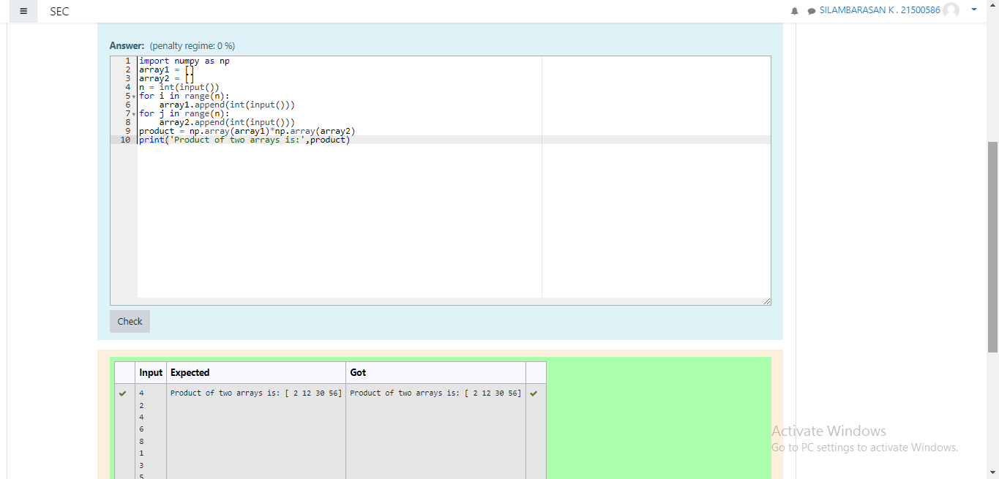

# Multiplying-two-matrix

## AIM:
To multipy two matrices using numpy module.

## ALGORITHM:

### Step 1:
Import numpy as np

### Step 2:
Declare a variable array1 as an empty list.

### Step 3:
Declare a variable array2 as an empty list.

### Step 4:
Get input value as n

### Step 5:
Iterate a variable i in range n by for loop and append the values to the list array1 End the loop

### Step 6:
Iterate a vairalbe j in range of n by for loop and append the values to the list array2 End the loop

### Step 7:
Declare a variable prodcut to array and compute array1*array2

Step 8:
Print the the value of the product
## PROGRAM:
```
#Developed by: Koduru Sanath Kumar Reddy
#Register number: 212221240024
import numpy as np
array1 = []
array2 = []
n = int(input())
for i in range(n):
    array1.append(int(input()))
for j in range(n):
    array2.append(int(input()))
product = np.array(array1)*np.array(array2)
print('Product of two arrays is:',product)
```
## OUTPUT:


## RESULT:
Hence the numpy module is imported and the programme is succefuuly executed to find the product of two matrices.


